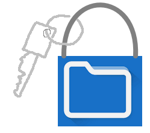
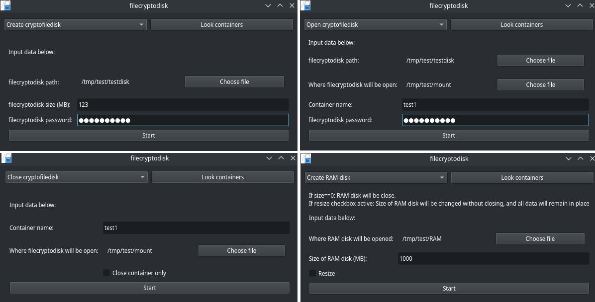

# Что это?

`filecryptodisk` - это скрипт, который упростит создание **криптоконтейнеров** и **RAM-диска** на ОС `GNU/Linux`.



**Криптоконтейнер** можно создать в виде **файла**, тем самым сделав его полностью портативным. Вместо файла можно использовать и девайсы (`/dev/sd*`), например, флешки.

На данный момент (23.06.2022) используется шифрование `aes-xts` с ключом 512 бит.

# Зависимости

Для работы понадобятся утилиты `cryptsetup` и `zenity` (очень вероятно, что эти утилиты уже установлены в системе):

``` bash
# Arch
> yay cryptsetup
> yay zenity

# Debian/Ubuntu
> sudo apt update
> sudo apt install cryptsetup
> sudo apt install zenity
```

Также нужно установить пакет `PyQt5` для `Python`:

``` bash
> python3 -m pip install --upgrade pip
> pip3 install PyQt5
```

# Установка

Скачайте файл, перенесите его в одну из директорий из `$PATH` и сделайте исполняемым. Например, так:

``` bash
> wget -O ~/.local/bin/filecryptodisk https://raw.githubusercontent.com/The220th/filecryptodisk/main/filecryptodisk && chmod u+x ~/.local/bin/filecryptodisk
```

# Использование

Запуск:

``` bash
> filecryptodisk
```

[Видео с демонтрацией](https://youtu.be/s08_ltpw5TI): [https://youtu.be/s08_ltpw5TI](https://youtu.be/s08_ltpw5TI)

После закрытия **RAM-диска** или внезапного выключения ПК всё содержимое этого **RAM-диска** безвозвратно уничтожается. Если вы перенесли **криптоконтейнер** в **RAM-диск**, то учтите это.



Вычисление хеша работает не только для контейнеров, но и для любых директорий. 

Скрипт требует права суперадминистратора (root), поэтому помните, что в первый раз при выполнении какой-либо операции всплывёт окошко, где будет предложено ввести пароль для sudo.

# Скрипт оперирует этими командами

Любая команда перед выполнением будет отображаться в терминале.

Везде вместо `SUDO_ASKPASS={RootPassScriptPath} sudo --askpass %command%` можно подставлять просто `sudo` или `pkexec`.

``` bash
# Создание:

> dd if=/dev/zero of={filePath} bs=1M count={size} && sync
> echo -n "{pswd}" | SUDO_ASKPASS={RootPassScriptPath} sudo --askpass cryptsetup luksFormat {filePath} -
> echo -n "{pswd}" | SUDO_ASKPASS={RootPassScriptPath} sudo --askpass cryptsetup luksOpen {filePath} {conRndName} -
> SUDO_ASKPASS={RootPassScriptPath} sudo --askpass mkfs.ext4 /dev/mapper/{conRndName}
> SUDO_ASKPASS={RootPassScriptPath} sudo --askpass cryptsetup luksClose {conRndName}

# Открытие:

> echo -n "{pswd}" | SUDO_ASKPASS={RootPassScriptPath} sudo --askpass cryptsetup luksOpen {filePath} {container} -
> SUDO_ASKPASS={RootPassScriptPath} sudo --askpass mount /dev/mapper/{container} {mountPath}
> SUDO_ASKPASS={RootPassScriptPath} sudo --askpass chown -R {sysuser} {mountPath}

# Закрытие:
> SUDO_ASKPASS={RootPassScriptPath} sudo --askpass umount {mountPath}
> SUDO_ASKPASS={RootPassScriptPath} sudo --askpass cryptsetup luksClose {container}

# Информация о контейнере:
> SUDO_ASKPASS={RootPassScriptPath} sudo --askpass cryptsetup -v status {container}

# Создание RAM-диска:
> SUDO_ASKPASS={RootPassScriptPath} sudo --askpass chown -R {sysuser} {mountPath}
# Изменение размера RAM-диска:
> SUDO_ASKPASS={RootPassScriptPath} sudo --askpass mount -t tmpfs -o remount,size={size}M tmpfs {mountPath}
# Закрытие RAM-диска:
> SUDO_ASKPASS={RootPassScriptPath} sudo --askpass umount {mountPath}
```

- `{filePath}`: Путь до файла, представляющего собой контейнер;

- `{mountPath}`: Путь до директории, где откроется контейнер/RAM-диск;

- `{container}`: Временное название контейнера при его открытии;

- `{pswd}`: Пароль от контейнера;

- `{size}`: Размер RAM-диска/файла, представляющего собой контейнер;

- `{sysuser}`: Имя пользователя системы;

- `{RootPassScriptPath}`: Путь до скрипта с содержимым:

``` bash
#!/bin/bash
zenity --password --title="sudo password prompt"
```